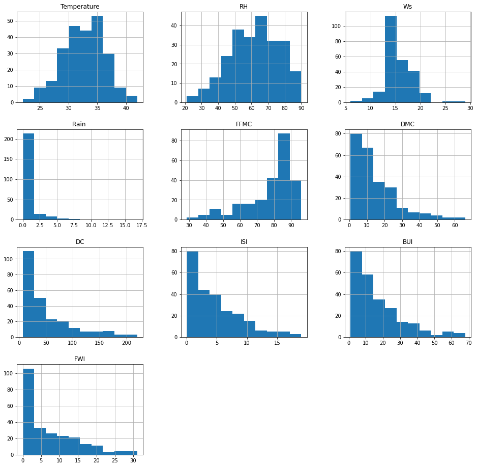
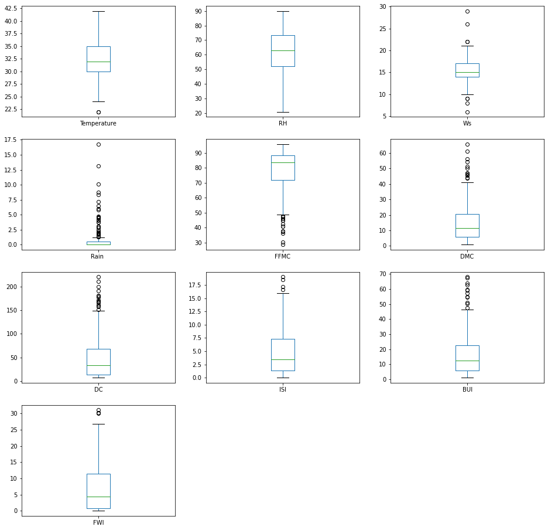

# Analysing the 'Algerian Forest Fires Dataset Data Set' from the UC Irvine Machine Learning repository

This notebook is used to analyze the 'Algerian Forest Fires Dataset Data Set' from the UC Irvine Machine Learning repository. The data set is available [here](https://archive.ics.uci.edu/ml/datasets/Algerian+Forest+Fires+Dataset++). **The objective of the notebook is to create a model to classify the instances into fire or not fire**.

The dataset includes 244 instances that regroup a data of two regions of Algeria,namely the Bejaia region located in the northeast of Algeria and the Sidi Bel-abbes region located in the northwest of Algeria. 122 instances for each region. The period od the data colletcion was June 2012 to September 2012. The dataset includes 11 attribues and 1 output attribue (class):


1. Date: (DD/MM/YYYY) Day, month ('june' to 'september'), year (2012)
2. Temp: temperature noon (temperature max) in Celsius degrees: 22 to 42
3. RH: Relative Humidity in %: 21 to 90
4. Ws: Wind speed in km/h: 6 to 29
5. Rain: total day in mm: 0 to 16.8
6. Fine Fuel Moisture Code (FFMC) index from the FWI system: 28.6 to 92.5
7. Duff Moisture Code (DMC) index from the FWI system: 1.1 to 65.9
8. Drought Code (DC) index from the FWI system: 7 to 220.4
9. Initial Spread Index (ISI) index from the FWI system: 0 to 18.5
10. Buildup Index (BUI) index from the FWI system: 1.1 to 68
11. Fire Weather Index (FWI) Index: 0 to 31.1
12. Classes: two classes, namely fire and not fire

The notebook is organized as follows:

1. Data exploration
2. Train ML model
3. Evaluate the ML model
4. Conclusion

----------

## 1. Data exploration

In this section, we import the data set and organize it. The result is a data set with 244 rows and 13 columns ('Temperature', 'RH', 'Ws', 'Rain ', 'FFMC', 'DMC', 'DC', 'ISI', 'BUI', 'FWI', 'Classes', 'region', 'date')


```python
import pandas as pd
import numpy as np
import matplotlib.pyplot as plt
```

----------

### Getting the data


```python
data = pd.read_csv('/Users/leuzinger/Dropbox/Data Science/Awari/Classification/Algerian_forest_fires_dataset_UPDATE.csv')
data.reset_index(inplace=True)
pd.set_option('display.max_columns', None)
pd.set_option('display.max_rows', None)
data.head()
```


<div>
<style scoped>
    .dataframe tbody tr th:only-of-type {
        vertical-align: middle;
    }

    .dataframe tbody tr th {
        vertical-align: top;
    }

    .dataframe thead th {
        text-align: right;
    }
</style>
<table border="1" class="dataframe">
  <thead>
    <tr style="text-align: right;">
      <th></th>
      <th>level_0</th>
      <th>level_1</th>
      <th>level_2</th>
      <th>level_3</th>
      <th>level_4</th>
      <th>level_5</th>
      <th>level_6</th>
      <th>level_7</th>
      <th>level_8</th>
      <th>level_9</th>
      <th>level_10</th>
      <th>level_11</th>
      <th>level_12</th>
      <th>Bejaia Region Dataset</th>
    </tr>
  </thead>
  <tbody>
    <tr>
      <th>0</th>
      <td>day</td>
      <td>month</td>
      <td>year</td>
      <td>Temperature</td>
      <td>RH</td>
      <td>Ws</td>
      <td>Rain</td>
      <td>FFMC</td>
      <td>DMC</td>
      <td>DC</td>
      <td>ISI</td>
      <td>BUI</td>
      <td>FWI</td>
      <td>Classes</td>
    </tr>
    <tr>
      <th>1</th>
      <td>01</td>
      <td>06</td>
      <td>2012</td>
      <td>29</td>
      <td>57</td>
      <td>18</td>
      <td>0</td>
      <td>65.7</td>
      <td>3.4</td>
      <td>7.6</td>
      <td>1.3</td>
      <td>3.4</td>
      <td>0.5</td>
      <td>not fire</td>
    </tr>
    <tr>
      <th>2</th>
      <td>02</td>
      <td>06</td>
      <td>2012</td>
      <td>29</td>
      <td>61</td>
      <td>13</td>
      <td>1.3</td>
      <td>64.4</td>
      <td>4.1</td>
      <td>7.6</td>
      <td>1</td>
      <td>3.9</td>
      <td>0.4</td>
      <td>not fire</td>
    </tr>
    <tr>
      <th>3</th>
      <td>03</td>
      <td>06</td>
      <td>2012</td>
      <td>26</td>
      <td>82</td>
      <td>22</td>
      <td>13.1</td>
      <td>47.1</td>
      <td>2.5</td>
      <td>7.1</td>
      <td>0.3</td>
      <td>2.7</td>
      <td>0.1</td>
      <td>not fire</td>
    </tr>
    <tr>
      <th>4</th>
      <td>04</td>
      <td>06</td>
      <td>2012</td>
      <td>25</td>
      <td>89</td>
      <td>13</td>
      <td>2.5</td>
      <td>28.6</td>
      <td>1.3</td>
      <td>6.9</td>
      <td>0</td>
      <td>1.7</td>
      <td>0</td>
      <td>not fire</td>
    </tr>
  </tbody>
</table>
</div>


```python
data.columns=['day','month','year','Temperature','RH','Ws','Rain ','FFMC','DMC','DC','ISI','BUI','FWI','Classes']
data['region'] = 'Bejaia'
data.loc[123:,'region'] = 'Sidi-Bel Abbes'
data = data.drop([0,123,124],axis=0)
data.head()
```


<div>
<style scoped>
    .dataframe tbody tr th:only-of-type {
        vertical-align: middle;
    }

    .dataframe tbody tr th {
        vertical-align: top;
    }

    .dataframe thead th {
        text-align: right;
    }
</style>
<table border="1" class="dataframe">
  <thead>
    <tr style="text-align: right;">
      <th></th>
      <th>day</th>
      <th>month</th>
      <th>year</th>
      <th>Temperature</th>
      <th>RH</th>
      <th>Ws</th>
      <th>Rain</th>
      <th>FFMC</th>
      <th>DMC</th>
      <th>DC</th>
      <th>ISI</th>
      <th>BUI</th>
      <th>FWI</th>
      <th>Classes</th>
      <th>region</th>
    </tr>
  </thead>
  <tbody>
    <tr>
      <th>1</th>
      <td>01</td>
      <td>06</td>
      <td>2012</td>
      <td>29</td>
      <td>57</td>
      <td>18</td>
      <td>0</td>
      <td>65.7</td>
      <td>3.4</td>
      <td>7.6</td>
      <td>1.3</td>
      <td>3.4</td>
      <td>0.5</td>
      <td>not fire</td>
      <td>Bejaia</td>
    </tr>
    <tr>
      <th>2</th>
      <td>02</td>
      <td>06</td>
      <td>2012</td>
      <td>29</td>
      <td>61</td>
      <td>13</td>
      <td>1.3</td>
      <td>64.4</td>
      <td>4.1</td>
      <td>7.6</td>
      <td>1</td>
      <td>3.9</td>
      <td>0.4</td>
      <td>not fire</td>
      <td>Bejaia</td>
    </tr>
    <tr>
      <th>3</th>
      <td>03</td>
      <td>06</td>
      <td>2012</td>
      <td>26</td>
      <td>82</td>
      <td>22</td>
      <td>13.1</td>
      <td>47.1</td>
      <td>2.5</td>
      <td>7.1</td>
      <td>0.3</td>
      <td>2.7</td>
      <td>0.1</td>
      <td>not fire</td>
      <td>Bejaia</td>
    </tr>
    <tr>
      <th>4</th>
      <td>04</td>
      <td>06</td>
      <td>2012</td>
      <td>25</td>
      <td>89</td>
      <td>13</td>
      <td>2.5</td>
      <td>28.6</td>
      <td>1.3</td>
      <td>6.9</td>
      <td>0</td>
      <td>1.7</td>
      <td>0</td>
      <td>not fire</td>
      <td>Bejaia</td>
    </tr>
    <tr>
      <th>5</th>
      <td>05</td>
      <td>06</td>
      <td>2012</td>
      <td>27</td>
      <td>77</td>
      <td>16</td>
      <td>0</td>
      <td>64.8</td>
      <td>3</td>
      <td>14.2</td>
      <td>1.2</td>
      <td>3.9</td>
      <td>0.5</td>
      <td>not fire</td>
      <td>Bejaia</td>
    </tr>
  </tbody>
</table>
</div>


```python
data.info()
```

    <class 'pandas.core.frame.DataFrame'>
    Int64Index: 244 entries, 1 to 246
    Data columns (total 15 columns):
     #   Column       Non-Null Count  Dtype 
    ---  ------       --------------  ----- 
     0   day          244 non-null    object
     1   month        244 non-null    object
     2   year         244 non-null    object
     3   Temperature  244 non-null    object
     4   RH           244 non-null    object
     5   Ws           244 non-null    object
     6   Rain         244 non-null    object
     7   FFMC         244 non-null    object
     8   DMC          244 non-null    object
     9   DC           244 non-null    object
     10  ISI          244 non-null    object
     11  BUI          244 non-null    object
     12  FWI          244 non-null    object
     13  Classes      243 non-null    object
     14  region       244 non-null    object
    dtypes: object(15)
    memory usage: 30.5+ KB


```python
#there was an issue with this line. The values of two columns were combined in a single column.

data.loc[168,:] = ['14', '07', '2012', '37', '37', '18', '0.2', '88.9', '12.9',
       '14.6','9', '12.5', '10.4', 'fire', 'Sidi-Bel Abbes']
```


```python
data['date'] = data[['year','month','day']].agg('-'.join, axis=1)
data = data.drop(['year','month','day'],axis=1)
```


```python
data[['Temperature', 'RH', 'Ws']] = data[['Temperature', 'RH', 'Ws']].astype(int)
data[['Rain ', 'FFMC','DMC', 'DC', 'ISI', 'BUI', 'FWI']] = data[['Rain ', 'FFMC','DMC', 'DC', 'ISI', 'BUI', 'FWI']].astype(float)
data["date"] = pd.to_datetime(data["date"], format="%Y-%m-%d")
data.info()
```

    <class 'pandas.core.frame.DataFrame'>
    Int64Index: 244 entries, 1 to 246
    Data columns (total 13 columns):
     #   Column       Non-Null Count  Dtype         
    ---  ------       --------------  -----         
     0   Temperature  244 non-null    int64         
     1   RH           244 non-null    int64         
     2   Ws           244 non-null    int64         
     3   Rain         244 non-null    float64       
     4   FFMC         244 non-null    float64       
     5   DMC          244 non-null    float64       
     6   DC           244 non-null    float64       
     7   ISI          244 non-null    float64       
     8   BUI          244 non-null    float64       
     9   FWI          244 non-null    float64       
     10  Classes      244 non-null    object        
     11  region       244 non-null    object        
     12  date         244 non-null    datetime64[ns]
    dtypes: datetime64[ns](1), float64(7), int64(3), object(2)
    memory usage: 34.8+ KB


```python
data.Classes.unique()
```


    array(['not fire   ', 'fire   ', 'fire', 'fire ', 'not fire', 'not fire ',
           'not fire     ', 'not fire    '], dtype=object)


```python
data['Classes'] = data['Classes'].str.replace(' ','').str.replace('  ','').str.replace('notfire','not fire')
```


```python
data.Classes.unique()
```


    array(['not fire', 'fire'], dtype=object)


```python
data.head()
```


<div>
<style scoped>
    .dataframe tbody tr th:only-of-type {
        vertical-align: middle;
    }

    .dataframe tbody tr th {
        vertical-align: top;
    }

    .dataframe thead th {
        text-align: right;
    }
</style>
<table border="1" class="dataframe">
  <thead>
    <tr style="text-align: right;">
      <th></th>
      <th>Temperature</th>
      <th>RH</th>
      <th>Ws</th>
      <th>Rain</th>
      <th>FFMC</th>
      <th>DMC</th>
      <th>DC</th>
      <th>ISI</th>
      <th>BUI</th>
      <th>FWI</th>
      <th>Classes</th>
      <th>region</th>
      <th>date</th>
    </tr>
  </thead>
  <tbody>
    <tr>
      <th>1</th>
      <td>29</td>
      <td>57</td>
      <td>18</td>
      <td>0.0</td>
      <td>65.7</td>
      <td>3.4</td>
      <td>7.6</td>
      <td>1.3</td>
      <td>3.4</td>
      <td>0.5</td>
      <td>not fire</td>
      <td>Bejaia</td>
      <td>2012-06-01</td>
    </tr>
    <tr>
      <th>2</th>
      <td>29</td>
      <td>61</td>
      <td>13</td>
      <td>1.3</td>
      <td>64.4</td>
      <td>4.1</td>
      <td>7.6</td>
      <td>1.0</td>
      <td>3.9</td>
      <td>0.4</td>
      <td>not fire</td>
      <td>Bejaia</td>
      <td>2012-06-02</td>
    </tr>
    <tr>
      <th>3</th>
      <td>26</td>
      <td>82</td>
      <td>22</td>
      <td>13.1</td>
      <td>47.1</td>
      <td>2.5</td>
      <td>7.1</td>
      <td>0.3</td>
      <td>2.7</td>
      <td>0.1</td>
      <td>not fire</td>
      <td>Bejaia</td>
      <td>2012-06-03</td>
    </tr>
    <tr>
      <th>4</th>
      <td>25</td>
      <td>89</td>
      <td>13</td>
      <td>2.5</td>
      <td>28.6</td>
      <td>1.3</td>
      <td>6.9</td>
      <td>0.0</td>
      <td>1.7</td>
      <td>0.0</td>
      <td>not fire</td>
      <td>Bejaia</td>
      <td>2012-06-04</td>
    </tr>
    <tr>
      <th>5</th>
      <td>27</td>
      <td>77</td>
      <td>16</td>
      <td>0.0</td>
      <td>64.8</td>
      <td>3.0</td>
      <td>14.2</td>
      <td>1.2</td>
      <td>3.9</td>
      <td>0.5</td>
      <td>not fire</td>
      <td>Bejaia</td>
      <td>2012-06-05</td>
    </tr>
  </tbody>
</table>
</div>


----------

### Data statistics and visualization

First, let's have a look at some statistics from the data set. We verifiy that the mean values of the attributes have different scales. Thus, there may be some benefit from standardizing the data [(GÉRON, 2019)](https://www.amazon.com.br/Hands-Machine-Learning-Scikit-Learn-TensorFlow/dp/1492032646).

Second, we must verify if our data set is balanced. **We can see that the classes are reasonably balanced between fires and not fires**.

"It is often useful to look at your data using multiple different visualizations in order to spark ideas" [(BROWNLEE, 2016)](https://machinelearningmastery.com/machine-learning-with-python/). Looking at the histogram of the atributes, we verify that some have Gaussian-like distributions and other exponential-like distributions. Besides, the boxplots show that the attributes have quite different spreads.


```python
data.describe()
```


<div>
<style scoped>
    .dataframe tbody tr th:only-of-type {
        vertical-align: middle;
    }

    .dataframe tbody tr th {
        vertical-align: top;
    }

    .dataframe thead th {
        text-align: right;
    }
</style>
<table border="1" class="dataframe">
  <thead>
    <tr style="text-align: right;">
      <th></th>
      <th>Temperature</th>
      <th>RH</th>
      <th>Ws</th>
      <th>Rain</th>
      <th>FFMC</th>
      <th>DMC</th>
      <th>DC</th>
      <th>ISI</th>
      <th>BUI</th>
      <th>FWI</th>
    </tr>
  </thead>
  <tbody>
    <tr>
      <th>count</th>
      <td>244.000000</td>
      <td>244.000000</td>
      <td>244.000000</td>
      <td>244.000000</td>
      <td>244.000000</td>
      <td>244.000000</td>
      <td>244.000000</td>
      <td>244.000000</td>
      <td>244.000000</td>
      <td>244.000000</td>
    </tr>
    <tr>
      <th>mean</th>
      <td>32.172131</td>
      <td>61.938525</td>
      <td>15.504098</td>
      <td>0.760656</td>
      <td>77.887705</td>
      <td>14.673361</td>
      <td>49.288115</td>
      <td>4.759836</td>
      <td>16.673361</td>
      <td>7.049180</td>
    </tr>
    <tr>
      <th>std</th>
      <td>3.633843</td>
      <td>14.884200</td>
      <td>2.810178</td>
      <td>1.999406</td>
      <td>14.337571</td>
      <td>12.368039</td>
      <td>47.619662</td>
      <td>4.154628</td>
      <td>14.201648</td>
      <td>7.428366</td>
    </tr>
    <tr>
      <th>min</th>
      <td>22.000000</td>
      <td>21.000000</td>
      <td>6.000000</td>
      <td>0.000000</td>
      <td>28.600000</td>
      <td>0.700000</td>
      <td>6.900000</td>
      <td>0.000000</td>
      <td>1.100000</td>
      <td>0.000000</td>
    </tr>
    <tr>
      <th>25%</th>
      <td>30.000000</td>
      <td>52.000000</td>
      <td>14.000000</td>
      <td>0.000000</td>
      <td>72.075000</td>
      <td>5.800000</td>
      <td>13.275000</td>
      <td>1.400000</td>
      <td>6.000000</td>
      <td>0.700000</td>
    </tr>
    <tr>
      <th>50%</th>
      <td>32.000000</td>
      <td>63.000000</td>
      <td>15.000000</td>
      <td>0.000000</td>
      <td>83.500000</td>
      <td>11.300000</td>
      <td>33.100000</td>
      <td>3.500000</td>
      <td>12.450000</td>
      <td>4.450000</td>
    </tr>
    <tr>
      <th>75%</th>
      <td>35.000000</td>
      <td>73.250000</td>
      <td>17.000000</td>
      <td>0.500000</td>
      <td>88.300000</td>
      <td>20.750000</td>
      <td>68.150000</td>
      <td>7.300000</td>
      <td>22.525000</td>
      <td>11.375000</td>
    </tr>
    <tr>
      <th>max</th>
      <td>42.000000</td>
      <td>90.000000</td>
      <td>29.000000</td>
      <td>16.800000</td>
      <td>96.000000</td>
      <td>65.900000</td>
      <td>220.400000</td>
      <td>19.000000</td>
      <td>68.000000</td>
      <td>31.100000</td>
    </tr>
  </tbody>
</table>
</div>


```python
data.groupby('Classes').size()
```


    Classes
    fire        138
    not fire    106
    dtype: int64


```python
data[['Temperature', 'RH', 'Ws', 'Rain ', 'FFMC', 'DMC', 'DC', 'ISI', 'BUI','FWI']].hist(sharex=False, sharey=False, xlabelsize=10, ylabelsize=10,figsize=(16, 16))
plt.show()
```


    

    


```python
data.plot(kind='box', subplots=True, layout=(4,3), sharex=False, sharey=False, fontsize=10, figsize=(16, 16))
plt.show()
```


    

    


----------

### Creating the Train and Test sets

Creating a test set at the beginning of the project avoid *data snooping* bias, i.e., "when you estimate the generalization error using the test set, your estimate will be too optimistic, and you will launch a system that will not perform as well as expected" (GÉRON, 2019).

Therefore, we create training and testing sets.


```python
from sklearn.model_selection import train_test_split

fire_X = data.drop('Classes',axis=1).copy()
fire_y = data['Classes'].copy()

X_train, X_test, y_train, y_test = train_test_split(fire_X, fire_y, test_size=0.2)
```


```python
fire_X_train = X_train.copy()
fire_y_train = y_train.copy()
fire_X_test = X_test.copy()
fire_y_test = y_test.copy()
```

----------

### Preparing the data for ML algorithms

Before creating the ML models, we need to prepare the data so that the ML algorithms will work properly.

First, we need to clean missing values from the dataset. Second, we need to put all the attributes in the same scale because "Machine Learning algorithms don’t perform well when the input numerical attributes have very different scales" (GÉRON, 2019).

We verify that there is no missing values in our data set. So, we just prepare a pipeline to do the scaling when necessary.

Besides, we do not expect the day to have a impact on the fires, but the month of the year can have some impact. Moreover, in this case the week of the year may be even more informative, as the weather conditions may varify during the month. Therefore, we convert the date attribute to week of the year.\

Finally, we encode the region as 0 (Bejaia) and 1 (Sidi-Bel Abbes).


```python
data.isnull().values.any()
```


    False


```python
fire_X_train['date'] = fire_X_train['date'].dt.week
fire_X_train = fire_X_train.rename(columns={'date': 'week'})
fire_X_train['region'] = fire_X_train['region'].str.replace('Bejaia','0').str.replace('Sidi-Bel Abbes','1')
fire_X_train['region'] = fire_X_train['region'].astype(int)
fire_X_train.head()
```

    <ipython-input-19-5925d5708dd2>:1: FutureWarning: Series.dt.weekofyear and Series.dt.week have been deprecated.  Please use Series.dt.isocalendar().week instead.
      fire_X_train['date'] = fire_X_train['date'].dt.week


<div>
<style scoped>
    .dataframe tbody tr th:only-of-type {
        vertical-align: middle;
    }

    .dataframe tbody tr th {
        vertical-align: top;
    }

    .dataframe thead th {
        text-align: right;
    }
</style>
<table border="1" class="dataframe">
  <thead>
    <tr style="text-align: right;">
      <th></th>
      <th>Temperature</th>
      <th>RH</th>
      <th>Ws</th>
      <th>Rain</th>
      <th>FFMC</th>
      <th>DMC</th>
      <th>DC</th>
      <th>ISI</th>
      <th>BUI</th>
      <th>FWI</th>
      <th>region</th>
      <th>week</th>
    </tr>
  </thead>
  <tbody>
    <tr>
      <th>231</th>
      <td>32</td>
      <td>51</td>
      <td>13</td>
      <td>0.0</td>
      <td>88.7</td>
      <td>16.0</td>
      <td>50.2</td>
      <td>6.9</td>
      <td>17.8</td>
      <td>9.8</td>
      <td>1</td>
      <td>37</td>
    </tr>
    <tr>
      <th>189</th>
      <td>38</td>
      <td>35</td>
      <td>15</td>
      <td>0.0</td>
      <td>93.8</td>
      <td>23.0</td>
      <td>42.7</td>
      <td>15.7</td>
      <td>22.9</td>
      <td>20.9</td>
      <td>1</td>
      <td>31</td>
    </tr>
    <tr>
      <th>205</th>
      <td>36</td>
      <td>81</td>
      <td>15</td>
      <td>0.0</td>
      <td>83.7</td>
      <td>34.4</td>
      <td>107.0</td>
      <td>3.8</td>
      <td>38.1</td>
      <td>9.0</td>
      <td>1</td>
      <td>34</td>
    </tr>
    <tr>
      <th>20</th>
      <td>30</td>
      <td>80</td>
      <td>16</td>
      <td>0.4</td>
      <td>59.8</td>
      <td>3.4</td>
      <td>27.1</td>
      <td>0.9</td>
      <td>5.1</td>
      <td>0.4</td>
      <td>0</td>
      <td>25</td>
    </tr>
    <tr>
      <th>146</th>
      <td>33</td>
      <td>46</td>
      <td>14</td>
      <td>1.1</td>
      <td>78.3</td>
      <td>8.1</td>
      <td>8.3</td>
      <td>1.9</td>
      <td>7.7</td>
      <td>1.2</td>
      <td>1</td>
      <td>25</td>
    </tr>
  </tbody>
</table>
</div>


```python
from sklearn.pipeline import Pipeline
from sklearn.preprocessing import StandardScaler

def estimator_scaler(estimator):
    #imputer = SimpleImputer(strategy='median')
    pipeline = Pipeline(steps=[('scaler',StandardScaler()),('model', estimator)])
    return pipeline 
```

----------

## 2. Train ML model

After preparing the data set, we are ready to select and train our ML model.

We start with two linear machine learning algorithms:

1. Logistic Regression (LogR). "Logistic regression assumes a Gaussian distribution for the numeric input variables and can model binary classification problem" (BROWNLEE, 2016). "It is commonly used to estimate the probability that an instance belongs to a particular class" (GÉRON, 2019).
2. Linear Discriminant Analysis (LDA). This is a statistical technique for binary and multiclass classification (BROWNLEE, 2016).

Then, we try some nonlinear machine learning algorithms:


3. k-Nearest Neighbors (KNN). This model "locates the k most similar instances in the training dataset for a new data instance" (BROWNLEE, 2016).
4. Naive Bayes. This method "calculates the probability of each class and the conditional probability of each class given each input value. These probabilities are estimated for new data and multiplied together, assuming that they are all independent (a simple or naive assumption)" (BROWNLEE, 2016). 
5. Classification and Regression Trees (CART). It uses "the train- ing data to select the best points to split the data in order to minimize a cost metric" (BROWNLEE, 2016).
6. Support Vector Machines (SVM). SVM seek a line that best separates two classes. It is one of the most popular models in Machine Learning (BROWNLEE, 2016; GÉRON, 2019).


Evaluating a classifier is often trickier than evaluating other ML models. **"Classification accuracy is the number of correct predictions made as a ratio of all predictions made**. This is the most common evaluation metric for classification problems, it is also the most misused" (BROWNLEE, 2016). 

**A good way to evaluate classification ML models is to use a confusion matrix**. "The general idea is to count the number of times instances of class A are classified as class B" (GÉRON, 2019). "A confusion matrix is simply a square matrix that reports the counts of the true positive (TP), true negative (TN), false positive (FP), and false negative (FN) predictions of a classifier" [(RASCHKA; MIRJALILI, 2019)](https://www.amazon.com.br/Python-Machine-Learning-Sebastian-Raschka-dp-1789955750/dp/1789955750/ref=dp_ob_title_bk). 

**A more concise metric to the confusion matrix is the accuracy of the positive predictions, called the precision of the classifier** (GÉRON, 2019). Precision can be calculated dividing the number of true positives by the sum of true positives and false positives (RASCHKA; MIRJALILI, 2019). "Precision is typically used along with another metric named recall, also called sensitivity or the true positive rate (TPR): this is the ratio of positive instances that are correctly detected by the classifier" (GÉRON, 2019). Recall can be calculated dividing the number of true positives by the sum of true positives and false negatives (RASCHKA; MIRJALILI, 2019).

Finally, **the receiver operating characteristic (ROC) curve is another common tool used with binary classifiers** (GÉRON, 2019). It is useful to select classification models based on their perfomance with respect to the true positive rate (TPR) and false positive rate (FPR) (RASCHKA; MIRJALILI, 2019).

Besides, "the key to a fair comparison of machine learning algorithms is ensuring that each algorithm is evaluated in the same way on the same data. You can achieve this by forcing each algorithm to be evaluated on a consistent test harness" (BROWNLEE, 2016). In this project, we do this by using the same split in the cross validation. We use the KFold function from the sklearn library with a random value rs as the random_state parameter. Although the rs value change everytime the notebook is run, once it is set, the same rs value is used in all the models. This guarantees that all the models are evaluated on the same data.

**The results show that the CART model has the best Accuracy, ROC-AUC and Precision of all tested models. The confusion matrix of this model has neither false positives nor false negatives**. The LogR model also has high Accuracy, ROC-AUC and Precision. However, the LogR model has one false positive in its confusion matrix. Furthermore, we see that feature scaling does not have a significant impact on the models, contrary to our initial analysis. The exception is the SVM model, which has better Accuracy and ROC-AUC when resources are scaled. 


```python
from sklearn.metrics import confusion_matrix
from sklearn.model_selection import RepeatedStratifiedKFold
from sklearn.model_selection import cross_val_score
from sklearn.metrics import classification_report
import warnings

warnings.filterwarnings("ignore")

def evaluation(model,X_train,y_train,rs):
    model.fit(X_train,y_train)
    yhat_train = model.predict(X_train)
    kfold = RepeatedStratifiedKFold(n_splits=10, n_repeats=3, random_state=rs)
    results_acc = cross_val_score(model, X_train, y_train, cv=kfold, scoring='accuracy')
    results_roc = cross_val_score(model, X_train, y_train, cv=kfold, scoring='roc_auc')
    CM = confusion_matrix(y_train,yhat_train)
    report = classification_report(y_train,yhat_train)
    print('Accuracy: %.6f (%.6f)' % (results_acc.mean(), results_acc.std()))
    print('\nConfusion Matrix:\n\n',CM)
    print('\nReport:\n',report)
    print('ROC-AUC: %.6f (%.6f)\n' % (results_roc.mean(), results_roc.std()))

def evaluation2(model,X_train,y_train,rs):
    model.fit(X_train,y_train)
    yhat_train = model.predict(X_train)
    kfold = RepeatedStratifiedKFold(n_splits=10, n_repeats=3, random_state=rs)
    results_acc = cross_val_score(model, X_train, y_train, cv=kfold, scoring='accuracy')
    results_roc = cross_val_score(model, X_train, y_train, cv=kfold, scoring='roc_auc')
    CM = confusion_matrix(y_train,yhat_train)
    report = classification_report(y_train,yhat_train,output_dict=True)
    
    return results_acc,CM,results_roc,report
```


```python
from random import randrange

rs = randrange(10000)
```


```python
from sklearn.linear_model import LogisticRegression

reg = evaluation(LogisticRegression(),fire_X_train,fire_y_train,rs)

pipe_reg = estimator_scaler(LogisticRegression())

reg_scl = evaluation(pipe_reg,fire_X_train,fire_y_train,rs)
```

    Accuracy: 0.962281 (0.039883)
    
    Confusion Matrix:
    
     [[117   0]
     [  1  77]]
    
    Report:
                   precision    recall  f1-score   support
    
            fire       0.99      1.00      1.00       117
        not fire       1.00      0.99      0.99        78
    
        accuracy                           0.99       195
       macro avg       1.00      0.99      0.99       195
    weighted avg       0.99      0.99      0.99       195
    
    ROC-AUC: 0.996433 (0.009206)
    
    Accuracy: 0.948772 (0.052862)
    
    Confusion Matrix:
    
     [[115   2]
     [  4  74]]
    
    Report:
                   precision    recall  f1-score   support
    
            fire       0.97      0.98      0.97       117
        not fire       0.97      0.95      0.96        78
    
        accuracy                           0.97       195
       macro avg       0.97      0.97      0.97       195
    weighted avg       0.97      0.97      0.97       195
    
    ROC-AUC: 0.992483 (0.014296)
    


```python
from sklearn.discriminant_analysis import LinearDiscriminantAnalysis

lda = evaluation(LinearDiscriminantAnalysis(),fire_X_train,fire_y_train,rs)

pipe_lda = estimator_scaler(LinearDiscriminantAnalysis())

lda_scl = evaluation(pipe_lda,fire_X_train,fire_y_train,rs)
```

    Accuracy: 0.930088 (0.061928)
    
    Confusion Matrix:
    
     [[113   4]
     [  6  72]]
    
    Report:
                   precision    recall  f1-score   support
    
            fire       0.95      0.97      0.96       117
        not fire       0.95      0.92      0.94        78
    
        accuracy                           0.95       195
       macro avg       0.95      0.94      0.95       195
    weighted avg       0.95      0.95      0.95       195
    
    ROC-AUC: 0.987374 (0.021206)
    
    Accuracy: 0.930088 (0.061928)
    
    Confusion Matrix:
    
     [[113   4]
     [  6  72]]
    
    Report:
                   precision    recall  f1-score   support
    
            fire       0.95      0.97      0.96       117
        not fire       0.95      0.92      0.94        78
    
        accuracy                           0.95       195
       macro avg       0.95      0.94      0.95       195
    weighted avg       0.95      0.95      0.95       195
    
    ROC-AUC: 0.987374 (0.021206)
    


```python
from sklearn.neighbors import KNeighborsClassifier

knn = evaluation(KNeighborsClassifier(),fire_X_train,fire_y_train,rs)

pipe_knn = estimator_scaler(KNeighborsClassifier())

knn_scl = evaluation(pipe_knn,fire_X_train,fire_y_train,rs)
```

    Accuracy: 0.917719 (0.058930)
    
    Confusion Matrix:
    
     [[116   1]
     [ 14  64]]
    
    Report:
                   precision    recall  f1-score   support
    
            fire       0.89      0.99      0.94       117
        not fire       0.98      0.82      0.90        78
    
        accuracy                           0.92       195
       macro avg       0.94      0.91      0.92       195
    weighted avg       0.93      0.92      0.92       195
    
    ROC-AUC: 0.947175 (0.049720)
    
    Accuracy: 0.893860 (0.054685)
    
    Confusion Matrix:
    
     [[115   2]
     [ 11  67]]
    
    Report:
                   precision    recall  f1-score   support
    
            fire       0.91      0.98      0.95       117
        not fire       0.97      0.86      0.91        78
    
        accuracy                           0.93       195
       macro avg       0.94      0.92      0.93       195
    weighted avg       0.94      0.93      0.93       195
    
    ROC-AUC: 0.944715 (0.059731)
    


```python
from sklearn.naive_bayes import GaussianNB

gnb = evaluation(GaussianNB(),fire_X_train,fire_y_train,rs)

pipe_gnb = estimator_scaler(GaussianNB())

gnb_scl = evaluation(pipe_gnb,fire_X_train,fire_y_train,rs)
```

    Accuracy: 0.945088 (0.051750)
    
    Confusion Matrix:
    
     [[110   7]
     [  4  74]]
    
    Report:
                   precision    recall  f1-score   support
    
            fire       0.96      0.94      0.95       117
        not fire       0.91      0.95      0.93        78
    
        accuracy                           0.94       195
       macro avg       0.94      0.94      0.94       195
    weighted avg       0.94      0.94      0.94       195
    
    ROC-AUC: 0.982991 (0.029086)
    
    Accuracy: 0.945088 (0.051750)
    
    Confusion Matrix:
    
     [[110   7]
     [  4  74]]
    
    Report:
                   precision    recall  f1-score   support
    
            fire       0.96      0.94      0.95       117
        not fire       0.91      0.95      0.93        78
    
        accuracy                           0.94       195
       macro avg       0.94      0.94      0.94       195
    weighted avg       0.94      0.94      0.94       195
    
    ROC-AUC: 0.982991 (0.029086)
    


```python
from sklearn.ensemble import RandomForestClassifier

cart = evaluation(RandomForestClassifier(random_state=rs),fire_X_train,fire_y_train,rs)

pipe_cart = estimator_scaler(RandomForestClassifier(random_state=rs))

cart_scl = evaluation(pipe_cart,fire_X_train,fire_y_train,rs)
```

    Accuracy: 0.976053 (0.039058)
    
    Confusion Matrix:
    
     [[117   0]
     [  0  78]]
    
    Report:
                   precision    recall  f1-score   support
    
            fire       1.00      1.00      1.00       117
        not fire       1.00      1.00      1.00        78
    
        accuracy                           1.00       195
       macro avg       1.00      1.00      1.00       195
    weighted avg       1.00      1.00      1.00       195
    
    ROC-AUC: 0.998722 (0.003887)
    
    Accuracy: 0.976053 (0.039058)
    
    Confusion Matrix:
    
     [[117   0]
     [  0  78]]
    
    Report:
                   precision    recall  f1-score   support
    
            fire       1.00      1.00      1.00       117
        not fire       1.00      1.00      1.00        78
    
        accuracy                           1.00       195
       macro avg       1.00      1.00      1.00       195
    weighted avg       1.00      1.00      1.00       195
    
    ROC-AUC: 0.998722 (0.003887)
    


```python
from sklearn.svm import SVC

svc = evaluation(SVC(),fire_X_train,fire_y_train,rs)

pipe_svc = estimator_scaler(SVC())

svc_scl = evaluation(pipe_svc,fire_X_train,fire_y_train,rs)
```

    Accuracy: 0.928158 (0.050766)
    
    Confusion Matrix:
    
     [[115   2]
     [ 11  67]]
    
    Report:
                   precision    recall  f1-score   support
    
            fire       0.91      0.98      0.95       117
        not fire       0.97      0.86      0.91        78
    
        accuracy                           0.93       195
       macro avg       0.94      0.92      0.93       195
    weighted avg       0.94      0.93      0.93       195
    
    ROC-AUC: 0.976790 (0.035086)
    
    Accuracy: 0.928158 (0.052553)
    
    Confusion Matrix:
    
     [[114   3]
     [  5  73]]
    
    Report:
                   precision    recall  f1-score   support
    
            fire       0.96      0.97      0.97       117
        not fire       0.96      0.94      0.95        78
    
        accuracy                           0.96       195
       macro avg       0.96      0.96      0.96       195
    weighted avg       0.96      0.96      0.96       195
    
    ROC-AUC: 0.985638 (0.015748)
    


```python
result = pd.DataFrame(columns=['model','Accuracy_mean','Accuracy_std','ROC-AUC_mean','ROC-AUC_std','Precision',
                               'Recall','f1-score','TN','FP','FN','TP'])

models = [LogisticRegression(),LinearDiscriminantAnalysis(),KNeighborsClassifier(),GaussianNB(),RandomForestClassifier(random_state=rs),SVC()]
models_str = ['LR','LDA','KNN','GaussianNB','CART','SVM']

for k in range(len(models)):
    results_acc,CM,results_roc,report = evaluation2(models[k],fire_X_train,fire_y_train,rs)
    results_ = [models_str[k],results_acc.mean(),results_acc.std(),results_roc.mean(),results_roc.std(),
                report['weighted avg']['precision'],report['weighted avg']['recall'],report['weighted avg']['f1-score'],
               CM[0,0],CM[0,1],CM[1,0],CM[1,1]]
    results_ = pd.Series(results_, index = result.columns)
    result = result.append(results_,ignore_index=True)
    pipe_ = estimator_scaler(models[k])
    results_acc_scl,CM_scl,results_roc_scl,report_scl = evaluation2(pipe_,fire_X_train,fire_y_train,rs)
    results_pipe = [models_str[k]+'_scl',results_acc_scl.mean(),results_acc_scl.std(),results_roc_scl.mean(),
                    results_roc_scl.std(),report_scl['weighted avg']['precision'],report_scl['weighted avg']['recall'],
                    report_scl['weighted avg']['f1-score'],CM[0,0],CM[0,1],CM[1,0],CM[1,1]]
    results_pipe = pd.Series(results_pipe, index = result.columns)
    result = result.append(results_pipe,ignore_index=True)

result
```


<div>
<style scoped>
    .dataframe tbody tr th:only-of-type {
        vertical-align: middle;
    }

    .dataframe tbody tr th {
        vertical-align: top;
    }

    .dataframe thead th {
        text-align: right;
    }
</style>
<table border="1" class="dataframe">
  <thead>
    <tr style="text-align: right;">
      <th></th>
      <th>model</th>
      <th>Accuracy_mean</th>
      <th>Accuracy_std</th>
      <th>ROC-AUC_mean</th>
      <th>ROC-AUC_std</th>
      <th>Precision</th>
      <th>Recall</th>
      <th>f1-score</th>
      <th>TN</th>
      <th>FP</th>
      <th>FN</th>
      <th>TP</th>
    </tr>
  </thead>
  <tbody>
    <tr>
      <th>0</th>
      <td>LR</td>
      <td>0.962281</td>
      <td>0.039883</td>
      <td>0.996433</td>
      <td>0.009206</td>
      <td>0.994915</td>
      <td>0.994872</td>
      <td>0.994866</td>
      <td>117</td>
      <td>0</td>
      <td>1</td>
      <td>77</td>
    </tr>
    <tr>
      <th>1</th>
      <td>LR_scl</td>
      <td>0.948772</td>
      <td>0.052862</td>
      <td>0.992483</td>
      <td>0.014296</td>
      <td>0.969306</td>
      <td>0.969231</td>
      <td>0.969161</td>
      <td>117</td>
      <td>0</td>
      <td>1</td>
      <td>77</td>
    </tr>
    <tr>
      <th>2</th>
      <td>LDA</td>
      <td>0.930088</td>
      <td>0.061928</td>
      <td>0.987374</td>
      <td>0.021206</td>
      <td>0.948695</td>
      <td>0.948718</td>
      <td>0.948602</td>
      <td>113</td>
      <td>4</td>
      <td>6</td>
      <td>72</td>
    </tr>
    <tr>
      <th>3</th>
      <td>LDA_scl</td>
      <td>0.930088</td>
      <td>0.061928</td>
      <td>0.987374</td>
      <td>0.021206</td>
      <td>0.948695</td>
      <td>0.948718</td>
      <td>0.948602</td>
      <td>113</td>
      <td>4</td>
      <td>6</td>
      <td>72</td>
    </tr>
    <tr>
      <th>4</th>
      <td>KNN</td>
      <td>0.917719</td>
      <td>0.058930</td>
      <td>0.947175</td>
      <td>0.049720</td>
      <td>0.929231</td>
      <td>0.923077</td>
      <td>0.921605</td>
      <td>116</td>
      <td>1</td>
      <td>14</td>
      <td>64</td>
    </tr>
    <tr>
      <th>5</th>
      <td>KNN_scl</td>
      <td>0.893860</td>
      <td>0.054685</td>
      <td>0.944715</td>
      <td>0.059731</td>
      <td>0.936025</td>
      <td>0.933333</td>
      <td>0.932527</td>
      <td>116</td>
      <td>1</td>
      <td>14</td>
      <td>64</td>
    </tr>
    <tr>
      <th>6</th>
      <td>GaussianNB</td>
      <td>0.945088</td>
      <td>0.051750</td>
      <td>0.982991</td>
      <td>0.029086</td>
      <td>0.944379</td>
      <td>0.943590</td>
      <td>0.943756</td>
      <td>110</td>
      <td>7</td>
      <td>4</td>
      <td>74</td>
    </tr>
    <tr>
      <th>7</th>
      <td>GaussianNB_scl</td>
      <td>0.945088</td>
      <td>0.051750</td>
      <td>0.982991</td>
      <td>0.029086</td>
      <td>0.944379</td>
      <td>0.943590</td>
      <td>0.943756</td>
      <td>110</td>
      <td>7</td>
      <td>4</td>
      <td>74</td>
    </tr>
    <tr>
      <th>8</th>
      <td>CART</td>
      <td>0.976053</td>
      <td>0.039058</td>
      <td>0.998722</td>
      <td>0.003887</td>
      <td>1.000000</td>
      <td>1.000000</td>
      <td>1.000000</td>
      <td>117</td>
      <td>0</td>
      <td>0</td>
      <td>78</td>
    </tr>
    <tr>
      <th>9</th>
      <td>CART_scl</td>
      <td>0.976053</td>
      <td>0.039058</td>
      <td>0.998722</td>
      <td>0.003887</td>
      <td>1.000000</td>
      <td>1.000000</td>
      <td>1.000000</td>
      <td>117</td>
      <td>0</td>
      <td>0</td>
      <td>78</td>
    </tr>
    <tr>
      <th>10</th>
      <td>SVM</td>
      <td>0.928158</td>
      <td>0.050766</td>
      <td>0.976790</td>
      <td>0.035086</td>
      <td>0.936025</td>
      <td>0.933333</td>
      <td>0.932527</td>
      <td>115</td>
      <td>2</td>
      <td>11</td>
      <td>67</td>
    </tr>
    <tr>
      <th>11</th>
      <td>SVM_scl</td>
      <td>0.928158</td>
      <td>0.052553</td>
      <td>0.985638</td>
      <td>0.015748</td>
      <td>0.959000</td>
      <td>0.958974</td>
      <td>0.958882</td>
      <td>115</td>
      <td>2</td>
      <td>11</td>
      <td>67</td>
    </tr>
  </tbody>
</table>
</div>


-----

### Algorithm Tuning

In this section, we are interested in tuning and comparing different parameter settings to further improve the performance for making predictions on unseen data. "This process is called model selection, with
the name referring to a given classification problem for which we want to select the optimal values of tuning parameters (also called hyperparameters)" (RASCHKA; MIRJALILI, 2019).

**We verifiy that the best parameters for the LogR model are C=100,penalty='l2',solver='lbfgs'. For the CART model, the best parameters are max_features='log2', and n_estimators=10. Besides, we verify that the CART model is better than the LR model**.


```python
from sklearn.model_selection import GridSearchCV

# define models and parameters
model = LogisticRegression()
solvers = ['newton-cg', 'lbfgs', 'liblinear']
penalty = ['l2']
c_values = [100, 10, 1.0, 0.1, 0.01]
scoring=['accuracy','roc_auc']

# define grid search
grid = dict(solver=solvers,penalty=penalty,C=c_values)
cv = RepeatedStratifiedKFold(n_splits=10, n_repeats=3, random_state=rs)
grid_search = GridSearchCV(estimator=model, param_grid=grid, n_jobs=-1, cv=cv, scoring=scoring,error_score=0,refit=False)
grid_result = grid_search.fit(fire_X_train, fire_y_train)

# summarize results
means_acc = grid_result.cv_results_['mean_test_accuracy']
means_roc = grid_result.cv_results_['mean_test_roc_auc']
stds_acc = grid_result.cv_results_['std_test_accuracy']
stds_roc = grid_result.cv_results_['std_test_roc_auc']
params = grid_result.cv_results_['params']
for mean_acc, stdev_acc, mean_roc, stdev_roc, param in zip(means_acc, stds_acc, means_roc, stds_roc, params):
    print("%f (%f) %f (%f) with: %r" % (mean_acc, stdev_acc, mean_roc, stdev_roc, param))
```

    0.970965 (0.038691) 0.997822 (0.005904) with: {'C': 100, 'penalty': 'l2', 'solver': 'newton-cg'}
    0.972544 (0.041189) 0.998169 (0.005040) with: {'C': 100, 'penalty': 'l2', 'solver': 'lbfgs'}
    0.970965 (0.044688) 0.996812 (0.006743) with: {'C': 100, 'penalty': 'l2', 'solver': 'liblinear'}
    0.970965 (0.038691) 0.998927 (0.003223) with: {'C': 10, 'penalty': 'l2', 'solver': 'newton-cg'}
    0.965877 (0.046036) 0.997822 (0.005904) with: {'C': 10, 'penalty': 'l2', 'solver': 'lbfgs'}
    0.965877 (0.046036) 0.996465 (0.007824) with: {'C': 10, 'penalty': 'l2', 'solver': 'liblinear'}
    0.969386 (0.038434) 0.998895 (0.003317) with: {'C': 1.0, 'penalty': 'l2', 'solver': 'newton-cg'}
    0.962281 (0.039883) 0.996433 (0.009206) with: {'C': 1.0, 'penalty': 'l2', 'solver': 'lbfgs'}
    0.962281 (0.039883) 0.996433 (0.009206) with: {'C': 1.0, 'penalty': 'l2', 'solver': 'liblinear'}
    0.965965 (0.046393) 0.998169 (0.005713) with: {'C': 0.1, 'penalty': 'l2', 'solver': 'newton-cg'}
    0.950439 (0.042509) 0.994219 (0.010635) with: {'C': 0.1, 'penalty': 'l2', 'solver': 'lbfgs'}
    0.945351 (0.048674) 0.992830 (0.012369) with: {'C': 0.1, 'penalty': 'l2', 'solver': 'liblinear'}
    0.952281 (0.047289) 0.995292 (0.008597) with: {'C': 0.01, 'penalty': 'l2', 'solver': 'newton-cg'}
    0.952281 (0.047289) 0.995292 (0.008597) with: {'C': 0.01, 'penalty': 'l2', 'solver': 'lbfgs'}
    0.926491 (0.063489) 0.983874 (0.023779) with: {'C': 0.01, 'penalty': 'l2', 'solver': 'liblinear'}


```python
evaluation(LogisticRegression(C=100,penalty='l2',solver='lbfgs'),fire_X_train,fire_y_train,rs)
evaluation(LogisticRegression(C=10,penalty='l2',solver='newton-cg'),fire_X_train,fire_y_train,rs)
```

    Accuracy: 0.972544 (0.041189)
    
    Confusion Matrix:
    
     [[117   0]
     [  0  78]]
    
    Report:
                   precision    recall  f1-score   support
    
            fire       1.00      1.00      1.00       117
        not fire       1.00      1.00      1.00        78
    
        accuracy                           1.00       195
       macro avg       1.00      1.00      1.00       195
    weighted avg       1.00      1.00      1.00       195
    
    ROC-AUC: 0.998169 (0.005040)
    
    Accuracy: 0.970965 (0.038691)
    
    Confusion Matrix:
    
     [[117   0]
     [  0  78]]
    
    Report:
                   precision    recall  f1-score   support
    
            fire       1.00      1.00      1.00       117
        not fire       1.00      1.00      1.00        78
    
        accuracy                           1.00       195
       macro avg       1.00      1.00      1.00       195
    weighted avg       1.00      1.00      1.00       195
    
    ROC-AUC: 0.998927 (0.003223)
    


```python
model = RandomForestClassifier(random_state=rs)
n_estimators = [10, 100, 1000]
max_features = ['sqrt', 'log2']
scoring=['accuracy','roc_auc']

# define grid search
grid = dict(n_estimators=n_estimators,max_features=max_features)
cv = RepeatedStratifiedKFold(n_splits=10, n_repeats=3, random_state=rs)
grid_search = GridSearchCV(estimator=model, param_grid=grid, n_jobs=-1, cv=cv, scoring=scoring,error_score=0,refit=False)
grid_result = grid_search.fit(fire_X_train, fire_y_train)

# summarize results
means_acc = grid_result.cv_results_['mean_test_accuracy']
means_roc = grid_result.cv_results_['mean_test_roc_auc']
stds_acc = grid_result.cv_results_['std_test_accuracy']
stds_roc = grid_result.cv_results_['std_test_roc_auc']
params = grid_result.cv_results_['params']
for mean_acc, stdev_acc, mean_roc, stdev_roc, param in zip(means_acc, stds_acc, means_roc, stds_roc, params):
    print("%f (%f) %f (%f) with: %r" % (mean_acc, stdev_acc, mean_roc, stdev_roc, param))
```

    0.981228 (0.030994) 0.993860 (0.016602) with: {'max_features': 'sqrt', 'n_estimators': 10}
    0.976053 (0.039058) 0.998722 (0.003887) with: {'max_features': 'sqrt', 'n_estimators': 100}
    0.976053 (0.039058) 0.998895 (0.003317) with: {'max_features': 'sqrt', 'n_estimators': 1000}
    0.981228 (0.030994) 0.993860 (0.016602) with: {'max_features': 'log2', 'n_estimators': 10}
    0.976053 (0.039058) 0.998722 (0.003887) with: {'max_features': 'log2', 'n_estimators': 100}
    0.976053 (0.039058) 0.998895 (0.003317) with: {'max_features': 'log2', 'n_estimators': 1000}


```python
evaluation(RandomForestClassifier(max_features='log2',n_estimators=10,random_state=rs),fire_X_train,fire_y_train,rs)
evaluation(RandomForestClassifier(max_features='sqrt',n_estimators=1000,random_state=rs),fire_X_train,fire_y_train,rs)
```

    Accuracy: 0.981228 (0.030994)
    
    Confusion Matrix:
    
     [[117   0]
     [  0  78]]
    
    Report:
                   precision    recall  f1-score   support
    
            fire       1.00      1.00      1.00       117
        not fire       1.00      1.00      1.00        78
    
        accuracy                           1.00       195
       macro avg       1.00      1.00      1.00       195
    weighted avg       1.00      1.00      1.00       195
    
    ROC-AUC: 0.993860 (0.016602)
    
    Accuracy: 0.976053 (0.039058)
    
    Confusion Matrix:
    
     [[117   0]
     [  0  78]]
    
    Report:
                   precision    recall  f1-score   support
    
            fire       1.00      1.00      1.00       117
        not fire       1.00      1.00      1.00        78
    
        accuracy                           1.00       195
       macro avg       1.00      1.00      1.00       195
    weighted avg       1.00      1.00      1.00       195
    
    ROC-AUC: 0.998895 (0.003317)
    


---------

# 3. Evaluate the ML model

Now evaluate the performance of our ML model in the test set, to see how it perform with unseen data.

First, we prepare the X_test data as we did with the X_train data.

Then, we test the two models, to check if the CART is better than LogR models with the test data too.

We see that both models have the same Accuracy, but the CART have a higher ROC-AUC. Besides, the LogR have a false negative, while the CART have a false positive. **Overeall, the CART model is slightly better than the LogR model for our data set**.


```python
fire_X_test['date'] = fire_X_test['date'].dt.week
fire_X_test = fire_X_test.rename(columns={'date': 'week'})
fire_X_test['region'] = fire_X_test['region'].str.replace('Bejaia','0').str.replace('Sidi-Bel Abbes','1')
fire_X_test['region'] = fire_X_test['region'].astype(int)
fire_X_test.head()
```


<div>
<style scoped>
    .dataframe tbody tr th:only-of-type {
        vertical-align: middle;
    }

    .dataframe tbody tr th {
        vertical-align: top;
    }

    .dataframe thead th {
        text-align: right;
    }
</style>
<table border="1" class="dataframe">
  <thead>
    <tr style="text-align: right;">
      <th></th>
      <th>Temperature</th>
      <th>RH</th>
      <th>Ws</th>
      <th>Rain</th>
      <th>FFMC</th>
      <th>DMC</th>
      <th>DC</th>
      <th>ISI</th>
      <th>BUI</th>
      <th>FWI</th>
      <th>region</th>
      <th>week</th>
    </tr>
  </thead>
  <tbody>
    <tr>
      <th>119</th>
      <td>31</td>
      <td>66</td>
      <td>11</td>
      <td>0.0</td>
      <td>85.7</td>
      <td>8.3</td>
      <td>24.9</td>
      <td>4.0</td>
      <td>9.0</td>
      <td>4.1</td>
      <td>0</td>
      <td>39</td>
    </tr>
    <tr>
      <th>67</th>
      <td>32</td>
      <td>75</td>
      <td>14</td>
      <td>0.0</td>
      <td>86.4</td>
      <td>13.0</td>
      <td>39.1</td>
      <td>5.2</td>
      <td>14.2</td>
      <td>6.8</td>
      <td>0</td>
      <td>32</td>
    </tr>
    <tr>
      <th>220</th>
      <td>30</td>
      <td>66</td>
      <td>15</td>
      <td>0.2</td>
      <td>73.5</td>
      <td>4.1</td>
      <td>26.6</td>
      <td>1.5</td>
      <td>6.0</td>
      <td>0.7</td>
      <td>1</td>
      <td>36</td>
    </tr>
    <tr>
      <th>115</th>
      <td>32</td>
      <td>54</td>
      <td>11</td>
      <td>0.5</td>
      <td>73.7</td>
      <td>7.9</td>
      <td>30.4</td>
      <td>1.2</td>
      <td>9.6</td>
      <td>0.7</td>
      <td>0</td>
      <td>38</td>
    </tr>
    <tr>
      <th>10</th>
      <td>28</td>
      <td>79</td>
      <td>12</td>
      <td>0.0</td>
      <td>73.2</td>
      <td>9.5</td>
      <td>46.3</td>
      <td>1.3</td>
      <td>12.6</td>
      <td>0.9</td>
      <td>0</td>
      <td>23</td>
    </tr>
  </tbody>
</table>
</div>


```python
from sklearn.metrics import accuracy_score
from sklearn.metrics import roc_auc_score

LR = LogisticRegression(C=100,penalty='l2',solver='lbfgs')
LR.fit(fire_X_train,fire_y_train)

fire_yhat_test = LR.predict(fire_X_test)
fire_yprob_test = LR.predict_proba(fire_X_test)[:,1]

acc = accuracy_score(fire_y_test,fire_yhat_test)
CM = confusion_matrix(fire_y_test,fire_yhat_test)
roc = roc_auc_score(fire_y_test,fire_yprob_test)
report = classification_report(fire_y_test,fire_yhat_test)

print('Accuracy: %.6f\n' % acc)
print('\nConfusion Matrix:\n\n',CM)
print('\nReport:\n',report)
print('ROC-AUC: %.6f\n' % roc)
```

    Accuracy: 0.979592
    
    
    Confusion Matrix:
    
     [[20  1]
     [ 0 28]]
    
    Report:
                   precision    recall  f1-score   support
    
            fire       1.00      0.95      0.98        21
        not fire       0.97      1.00      0.98        28
    
        accuracy                           0.98        49
       macro avg       0.98      0.98      0.98        49
    weighted avg       0.98      0.98      0.98        49
    
    ROC-AUC: 0.996599
    


```python
rcc = RandomForestClassifier(max_features='log2',n_estimators=10,random_state=rs)
rcc.fit(fire_X_train,fire_y_train)

fire_yhat_test = rcc.predict(fire_X_test)
fire_yprob_test = rcc.predict_proba(fire_X_test)[:,1]

acc = accuracy_score(fire_y_test,fire_yhat_test)
CM = confusion_matrix(fire_y_test,fire_yhat_test)
roc = roc_auc_score(fire_y_test,fire_yprob_test)
report = classification_report(fire_y_test,fire_yhat_test)

print('Accuracy: %.6f\n' % acc)
print('\nConfusion Matrix:\n\n',CM)
print('\nReport:\n',report)
print('ROC-AUC: %.6f\n' % roc)
```

    Accuracy: 0.979592
    
    
    Confusion Matrix:
    
     [[21  0]
     [ 1 27]]
    
    Report:
                   precision    recall  f1-score   support
    
            fire       0.95      1.00      0.98        21
        not fire       1.00      0.96      0.98        28
    
        accuracy                           0.98        49
       macro avg       0.98      0.98      0.98        49
    weighted avg       0.98      0.98      0.98        49
    
    ROC-AUC: 0.999150
    


----------------------

## 4. Conclusion

In this notebook, we created a model to classify the instances into fire or not fire in Algerian forests. 

First, we tested some classification models: 

1. Logistic Regression (LR)
2. Linear Discriminant Analysis (LDA)
3. k-Nearest Neighbors (KNN)
4. Naive Bayes
5. Classification and Regression Trees (CART)
6. Support Vector Machines (SVM)

In this first tests, the LR and the CART model performed bettet than the others. Beside, we verified that scaling the features had no significant impact in the models' perfomance.

**Therefore, we tested two models with our test set: (i) LogR and (ii) CART. We verified that the models performed similarly. However, the CART model was slightly better**.
